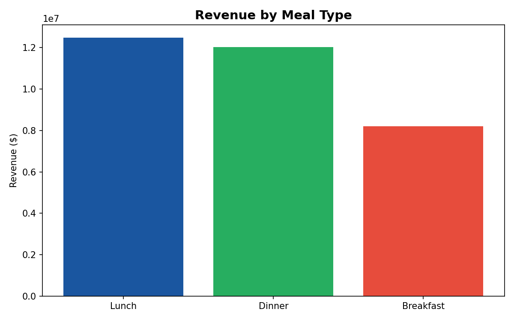
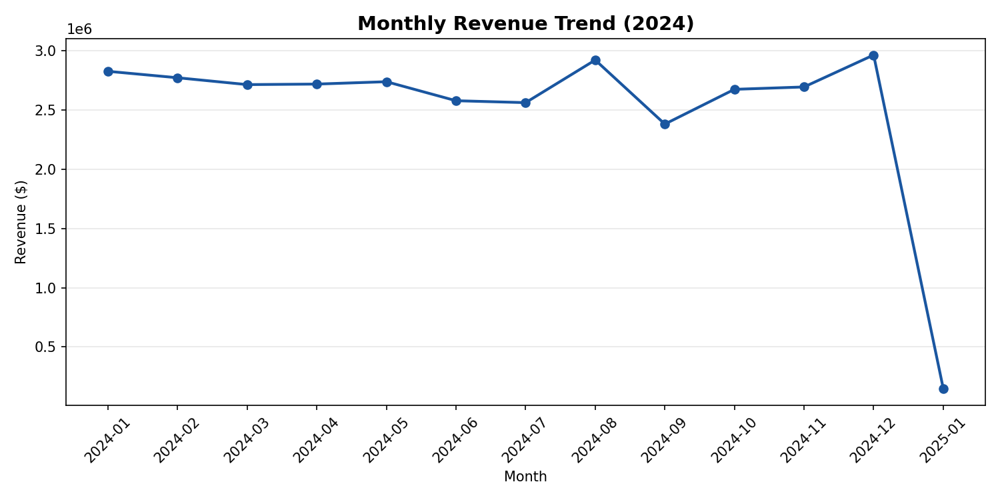
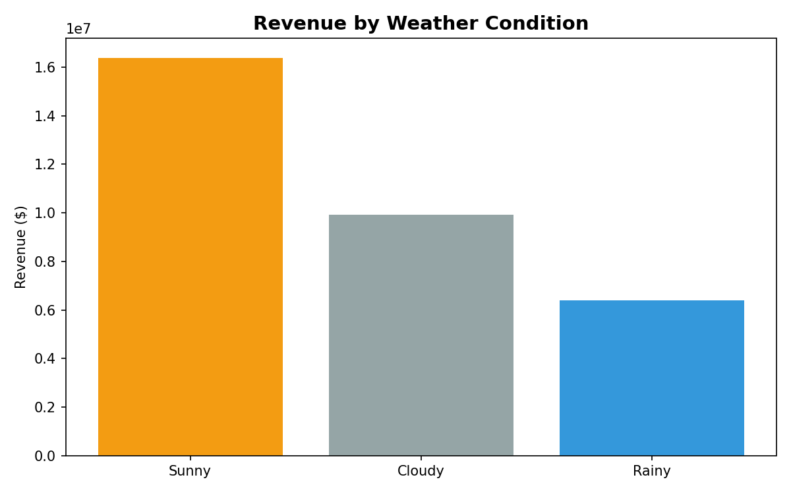
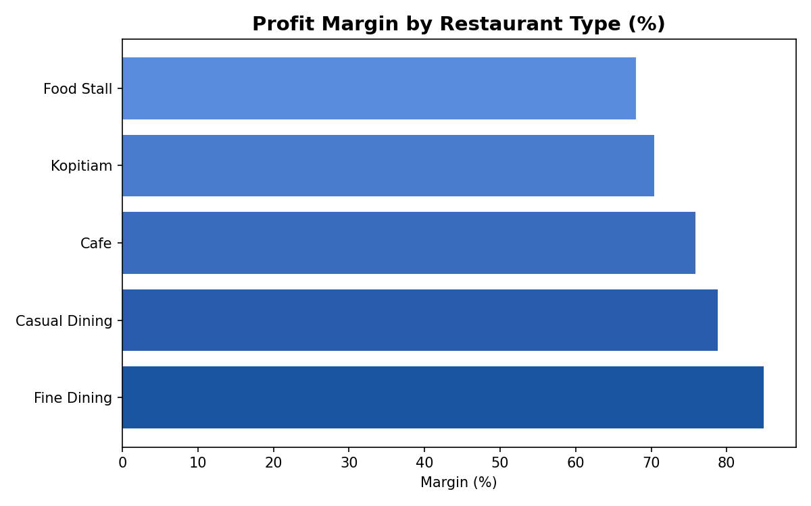
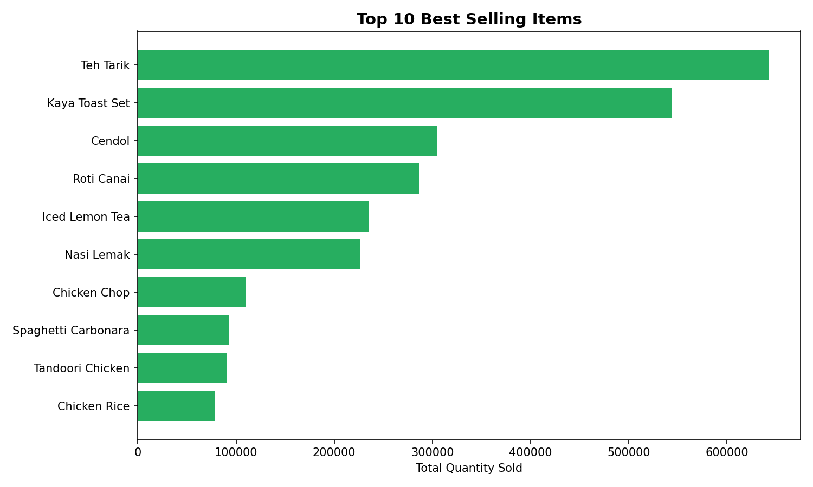
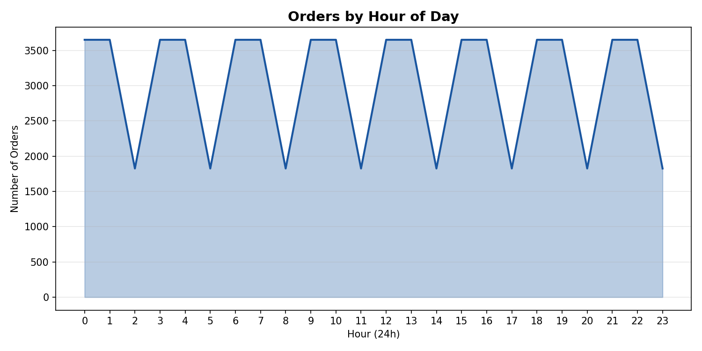
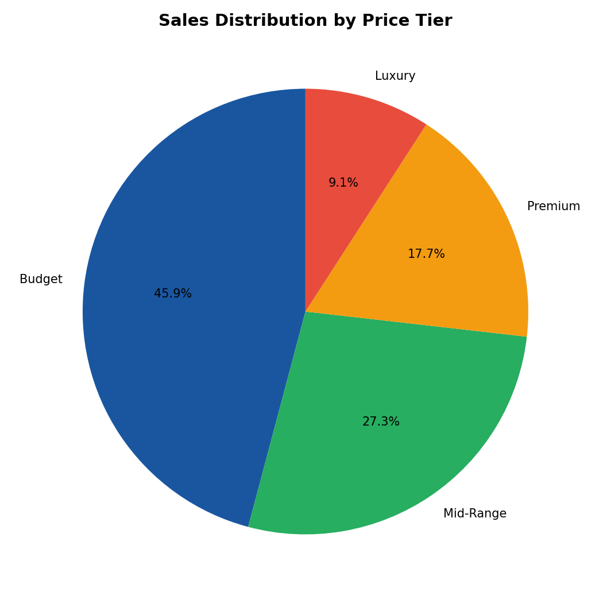
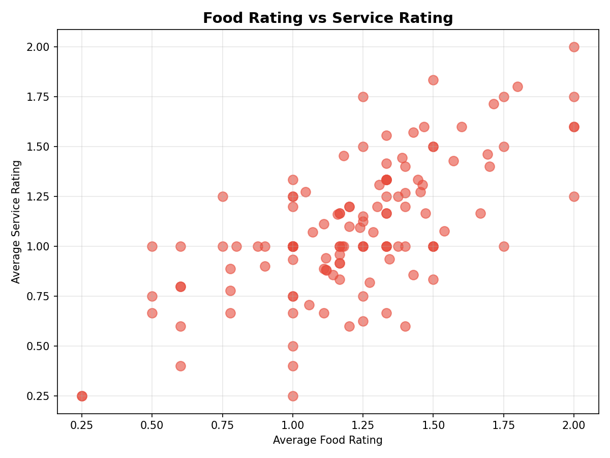

# Restaurant Business Intelligence System

## Project Overview
End-to-end business intelligence system for restaurant operations analysis. Built with PostgreSQL and Python, analysing 100,000+ rows of real data across 13 tables covering sales, customer reviews, ratings, and restaurant profiles.

## Database Architecture
- **Tool:** PostgreSQL 17 + pgAdmin 4
- **Total rows:** 100,000+
- **Tables:** 13

| Table | Rows | Description |
|---|---|---|
| orders | 73,000 | Individual order transactions with timestamps |
| sales | 10,000 | Sales with ingredients, promotions, weather |
| reviews | 10,000 | Customer reviews and ratings |
| menu_items | 71 | Menu items with price and cost |
| ratings | 1,161 | Food and service ratings per customer |
| restaurants | 130 | Restaurant locations and details |
| customers | 138 | Customer demographics and preferences |
| restaurant_payments | 1,314 | Payment methods accepted |
| restaurant_cuisines | 916 | Cuisine types per restaurant |
| restaurant_hours | 2,339 | Operating hours |
| restaurant_parking | 702 | Parking information |
| customer_cuisines | 330 | Customer cuisine preferences |
| customer_payments | 177 | Customer payment methods |

## Key Findings

### Sales & Revenue
- Lunch generates the highest revenue ($12.5M) despite Dinner having more orders
- Sunny weather drives 2.5x more orders than rainy days
- Fine Dining has the highest profit margin at 84.9%
- Food Stalls have the most volume but lowest margins at 68%

### Customer Insights
- Budget and mid-range items account for the majority of orders
- Food ratings and service ratings are positively correlated
- Cash remains the most popular payment method among customers

### Operations
- Peak ordering hours align with traditional meal times
- Items frequently ordered together reveal cross-selling opportunities
- Monthly revenue shows seasonal patterns with August being the strongest month

## Visualizations
8 professional charts created with Python and matplotlib:

### Revenue by Meal Type

### Monthly Revenue Trend

### Weather Impact on Sales

### Profit Margins by Restaurant Type

### Top 10 Best Selling Items

### Orders by Hour of Day

### Price Tier Distribution

### Food vs Service Ratings

## SQL Concepts Demonstrated
- Complex JOINs across multiple tables
- Window functions (LAG for growth rate calculation)
- CASE WHEN for data categorization
- Subqueries and nested queries
- Aggregate functions with GROUP BY and HAVING
- Date functions (TO_CHAR, EXTRACT)
- NULLIF for division-by-zero handling
- Self-joins for item pairing analysis
- UNION ALL for combining results

## Tech Stack
- **Database:** PostgreSQL 17
- **Database Management:** pgAdmin 4
- **Analysis:** SQL (20 queries across 6 categories)
- **Visualization:** Python 3, matplotlib, pandas
- **Data Connection:** psycopg2

## Data Sources
- Restaurant sales and orders data (Kaggle)
- Customer reviews and ratings (Kaggle)
- Restaurant profiles with consumer ratings (UCI ML Repository)
